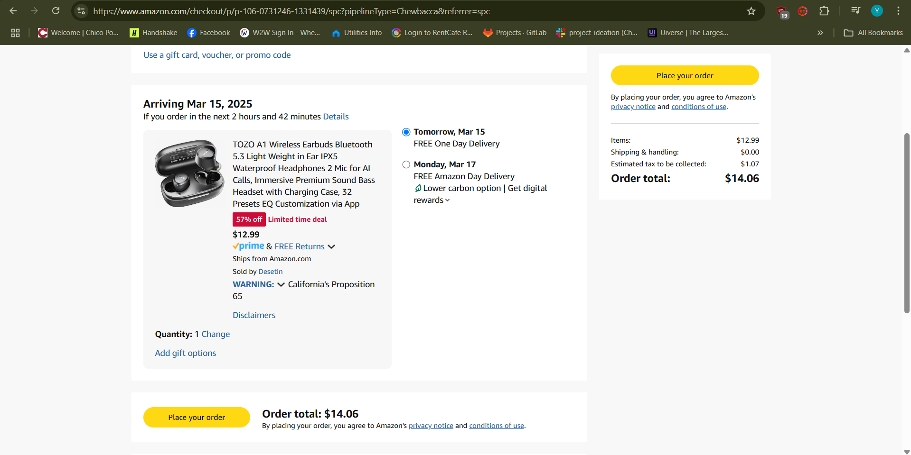
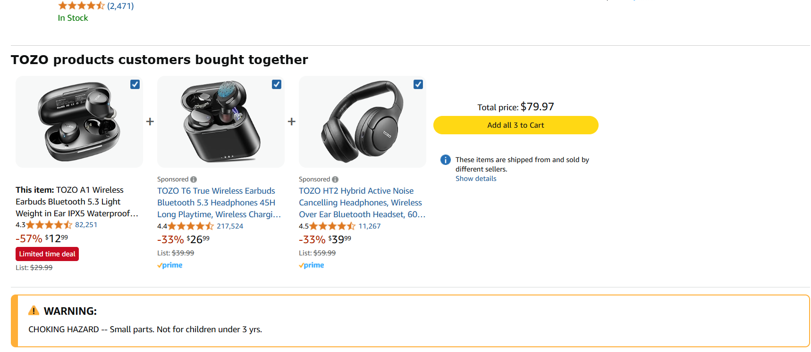

# A Tedious Attempt at Online Shopping  

**By [Yash Madan] | March 14, 2025**  

---

## A Frustrating Checkout Experience  

Recently, I attempted to purchase a set of wireless earbuds from **Amazon**, a leading e-commerce platform known for its vast product selection and user-friendly interface. While the initial browsing and selection process was smooth, the **checkout process** presented unexpected challenges that hindered the overall user experience.  

  

### The Interaction  

My goal was straightforward: complete the purchase swiftly and efficiently. However, the checkout process became cumbersome due to several usability issues:  

1. **Overwhelming Options** – During checkout, I was presented with numerous shipping options, add-on services, and promotional offers. While choices can be beneficial, the sheer volume without clear prioritization led to **decision fatigue**.  

2. **Confusing Navigation** – Navigating back to modify my cart or shipping details was not intuitive. The lack of clear breadcrumbs or a straightforward navigation path made the process feel disjointed.  

3. **Inconsistent Error Messaging** – Upon entering my payment information, I received a generic error message stating, `"There was an issue processing your payment."` The message lacked specificity, providing no guidance on whether the problem was with the card number, expiration date, or another detail.  

4. **Session Timeout** – After spending time resolving the above issues, my session timed out without warning, forcing me to restart the checkout process.  

  

### UX Concepts Applied  

- **Decision Fatigue** – Presenting users with too many options without clear guidance can lead to decision fatigue, where the user feels overwhelmed and is more likely to abandon the process.  
- **Clear Navigation** – An intuitive navigation system ensures users can move through the checkout process seamlessly, reducing confusion and potential errors.  
- **Specific Error Feedback** – Providing clear and actionable error messages helps users quickly identify and correct mistakes, enhancing the overall user experience.  
- **Session Management** – Informing users of session time limits or extending session durations during critical tasks like checkout prevents unexpected disruptions.  

### Strengths & Weaknesses  

#### **Strengths:**  
**Product Browsing** – The product selection and browsing experience were intuitive and efficient.  
**Responsive Design** – The website's responsive design ensured compatibility across various devices.  

#### **Weaknesses:**  
**Overwhelming Checkout Options** – The multitude of choices during checkout without clear prioritization led to confusion.  
**Poor Navigation** – Lack of clear navigation paths made modifying order details cumbersome.  
**Unclear Error Messages** – Generic error messaging without specific guidance hindered the correction process.  
**Session Timeout** – Unexpected session expirations disrupted the checkout flow.  

### Suggested Improvements  

**Simplify Checkout Options** – Streamline the checkout process by prioritizing essential options and using progressive disclosure for additional choices.  
**Enhance Navigation** – Implement clear navigation aids, such as breadcrumbs, to allow users to modify their orders effortlessly.  
**Provide Specific Error Feedback** – Ensure error messages are descriptive and guide users on how to rectify issues.  
**Improve Session Management** – Notify users of impending session timeouts and offer options to extend their session during critical tasks.  

---

This experience underscores how even established platforms like Amazon can encounter usability challenges that impact user satisfaction. Addressing these issues is crucial for maintaining a seamless and efficient user experience.   
