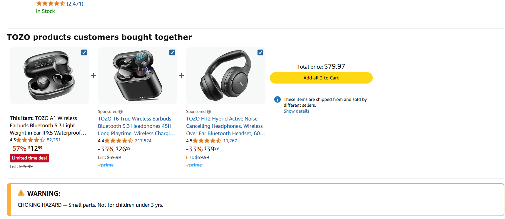

# A Tedious Attempt at Online Shopping  
**By Yash Madan | March 14, 2025**

---

## A Frustrating Checkout Experience  

Recently, I set out to purchase a pair of wireless earbuds from **Amazon**, a platform widely praised for its convenience and variety. My **goal** was simple: find a well-reviewed pair of earbuds, add them to my cart, and check out quickly. While the browsing experience met my expectations, the **checkout process** turned unexpectedly tedious.  

---

## Step-by-Step Interaction  

### **Step 1: Product Search & Selection**  
I began by searching for “wireless earbuds.” The search results were extensive. Using filters for price, brand, and ratings, I quickly narrowed it down and added a promising pair to my cart.

### **Step 2: Navigating to Checkout**  
Once I clicked "Proceed to Checkout," I encountered a long list of **shipping options**, extended warranties, and promotional upsells. These options were not clearly prioritized or visually grouped, which led to **decision fatigue**—a mental overload from making too many low-stakes decisions in sequence.

### **Step 3: Editing Shipping Address**  
I noticed my shipping address was outdated. Clicking to change it redirected me to a separate page. After updating it, I returned to checkout only to find my previously selected shipping method reset. This indicated a breakdown in **navigation design**, and the absence of **breadcrumbs** or a progress bar made the experience feel disjointed.

### **Step 4: Entering Payment Information**  
I input my card details and clicked submit, but received a vague error:  
> “There was an issue processing your payment.”  
There was no indication of whether the problem was with the card number, CVV, or expiration date. This violated the principle of **specific error feedback**, which is essential for helping users correct input mistakes quickly.

### **Step 5: Session Timeout**  
After troubleshooting the payment issue for a few minutes, my session timed out without warning. I was logged out and forced to restart. This showed poor **session management**, which should ideally include visible countdowns or prompts to extend the session.

---

## UX Concepts in Action  

- **Decision Fatigue**: Overloading the user with choices—especially during checkout—leads to cognitive overload and indecision. This could be improved using **progressive disclosure**, where secondary options appear only when needed.
  
- **Navigation Design**: The lack of persistent navigation or **breadcrumbs** made it hard to backtrack or revise details. A **wizard-style interface** with visual indicators would enhance usability.

- **Specific Error Feedback**: Generic error messages confuse users. Clear, field-level guidance helps users recover from mistakes more efficiently and reduces frustration.

- **Session Management**: Logging users out during a task without warning undermines trust. Sites should provide visible timers and allow users to extend their session during critical processes like checkout.

---

## Strengths & Weaknesses  

### **Strengths**
- **Product Browsing**: Filtering and sorting made the product selection smooth.
- **Responsive Design**: The mobile experience mirrored the desktop layout well.

### **Weaknesses**
- **Too Many Checkout Options**: Lack of prioritization caused cognitive overload.
- **Disjointed Navigation**: No consistent flow when modifying address or cart details.
- **Unclear Error Messages**: Generic payment errors provided no actionable guidance.
- **Session Expiration**: Unexpected timeout disrupted the purchase process.

---

## Suggested Improvements  

- **Streamline Checkout Options**: Use **progressive disclosure** to hide non-essential options until necessary.
- **Add Navigation Aids**: Incorporate **breadcrumbs** and progress bars to orient users during checkout.
- **Improve Error Messages**: Use specific, field-level validation to guide user corrections.
- **Extend or Warn Before Timeout**: Introduce session countdowns and keep users informed of time limits.

---

## Final Thoughts  

This experience revealed that even a well-established platform like Amazon is not immune to **UX pitfalls**. Smooth browsing can quickly be overshadowed by a clunky checkout process. Addressing these issues—especially around clarity and feedback—would significantly enhance the user experience.

---

